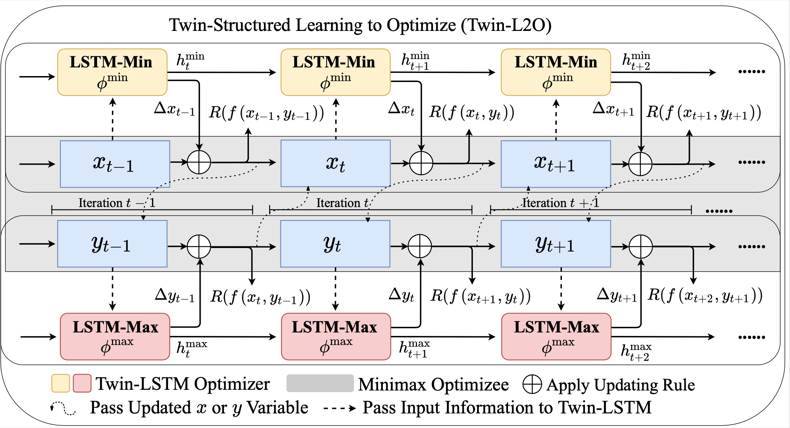
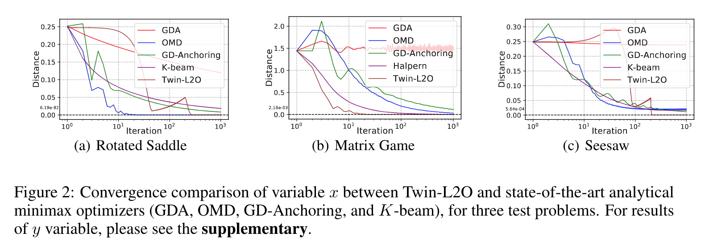
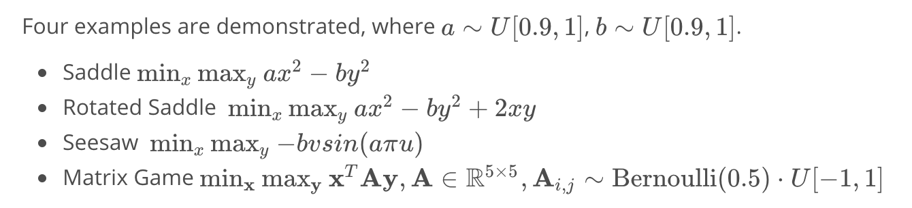

# Learning a Minimax Optimizer: A Pilot Study

[](https://opensource.org/licenses/MIT)

Code for this paper [Learning a Minimax Optimizer: A Pilot Study]()

Jiayi Shen\*, Xiaohan Chen\*, Howard Heaton*, Tianlong Chen, Jialin Liu, Wotao Yin, Zhangyang Wang

## Overview

Solving continuous minimax optimization is of extensive practical interest, yet notoriously unstable and difficult. We introduce the *learning to optimize* (L2O) methodology to the minimax problems for the first time, and addresses its accompanying unique challenges. We present *Twin L2O*, the first dedicated minimax L2O framework consisting of two LSTMs for updating min and max variables, respectively.  We then discuss a crucial concern of Twin-L2O, i.e., its inevitably limited generalizability to unseen optimizees, and present two complementary strategies. Our first solution, *Enhanced Twin-L2O*, is empirically applicable for general minimax problems, by improving L2O training via leveraging curriculum learning. Our second alternative, called *Safeguarded Twin L2O*, is a preliminary theoretical exploration stating that under some strong assumptions, it is possible to theoretically establish the convergence of Twin-L2O. 



## Main Experimental Results



## Implementation of Experiments

### Prerequisites

GPU: GeForce GTX 1080 Ti

Pytorch >= 1.3.0

### Configuration

The configuation files are stored in `/config` folder, depicting the experimental setting.

### Toy Examples Using Twin-L2O



#### Dataset

`/dataset/range1_train.txt`, `/dataset/range1_eval.txt` and `/dataset/range1_test.txt`  contain the data of $a$  and $b$  to construct training, evaluating, testing problems respectively , which are randomly generated using `np.random`. 

#### Training

In order to perform the training process, run the following command:

```shell
python Twin-L2O.py --config saddle_train  #saddle
python Twin-L2O.py --config rotatedsaddle_train  #rotated saddle
python Twin-L2O.py --config seesaw_train  #seesaw
python Twin-L2O.py --config matrix_game_dim1_train  #matrix game with dim=1
python Twin-L2O.py --config matrix_game_dim5_train  #matrix game with dim=5
```

#### Tesing

In order to perform the testing process, run the following command:

```shell
python Twin-L2O.py --config saddle_test  #saddle
python Twin-L2O.py --config rotatedsaddle_test  #rotated saddle
python Twin-L2O.py --config seesaw_test  #seesaw
python Twin-L2O.py --config matrix_game_dim1_test  #matrix game with dim=1
python Twin-L2O.py --config matrix_game_dim5_test  #matrix game with dim=5
```

### Seesaw Problem Using Twin-L2O+Curriculum Learning

#### Dataset

The distribution of $a$ and $b$ are stretched to the following setting, where the indices in the following table correspond with the dataset in the   `/dataset` folder.

| Uniform Distribution | 1            | 2            | 3            | 4            | 5            | 6          | 7          |
| -------------------- | ------------ | ------------ | ------------ | ------------ | ------------ | ---------- | ---------- |
| **a**                | **[0.9,1 ]** | **[0, 1]**   | **[0, 3.5]** | **[0, 5]**   | **[0.9, 1]** | **[0, 5]** | **[0, 5]** |
| **b**                | **[0.9, 1]** | **[0.9, 1]** | **[0.9, 1]** | **[0.9, 1]** | **[0, 1]**   | **[0, 1]** | **[0, 2]** |

#### Training

To perform training for Twin-L2O without curriculum Learning (Non-CL):

```shell
python Twin-L2O.py --config seesaw_range2_train 
# the same applies for other parameter ranges
```

To perform training for Twin-L2O with Curriculum Learning (CL): 

```shell
python Twin-L2O.py --config seesaw_range2_CL_train 
# the same applies for other parameter ranges
```

#### Testing

To perform testing for Twin-L2O without curriculum Learning (Non-CL):

```shell
python Twin-L2O.py --config seesaw_range2_test 
# the same applies for other parameter ranges
```

To perform testing for Twin-L2O with Curriculum Learning (CL):

```shell
python Twin-L2O.py --config seesaw_range2_CL_test 
# the same applies for other parameter ranges
```

## Acknowledgement

We thank the author of the original code [AdrienLE/learning_by_grad_by_grad_repro](https://github.com/AdrienLE/learning_by_grad_by_grad_repro) , from which we design and develop our code.

## Citation

```
@inproceedings{
shen2021learning,
title={Learning A Minimax Optimizer: A Pilot Study},
author={Jiayi Shen and Xiaohan Chen and Howard Heaton and Tianlong Chen and Jialin Liu and Wotao Yin and Zhangyang Wang},
booktitle={International Conference on Learning Representations},
year={2021},
url={https://openreview.net/forum?id=nkIDwI6oO4_}
}
```

