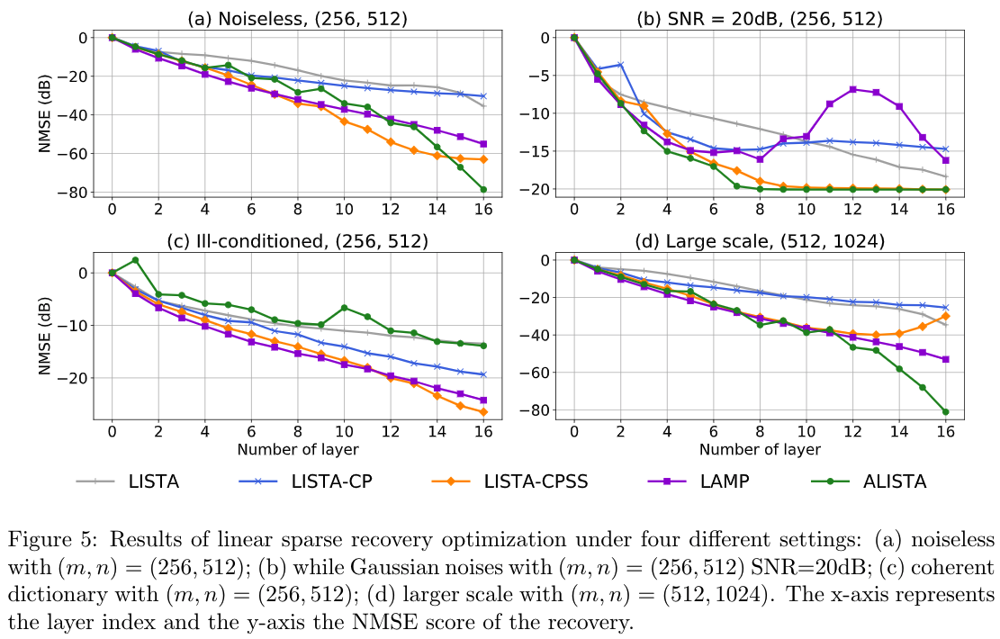
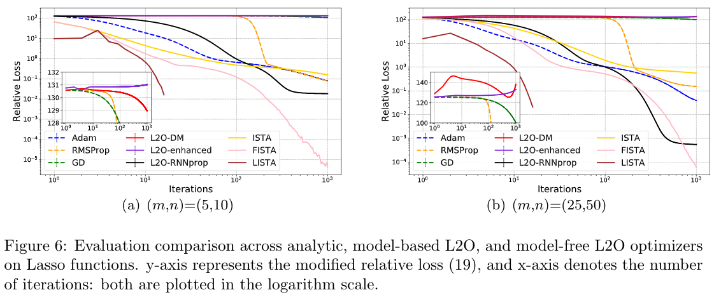
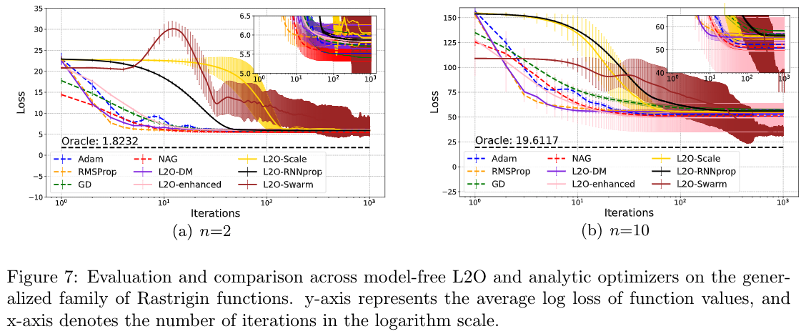
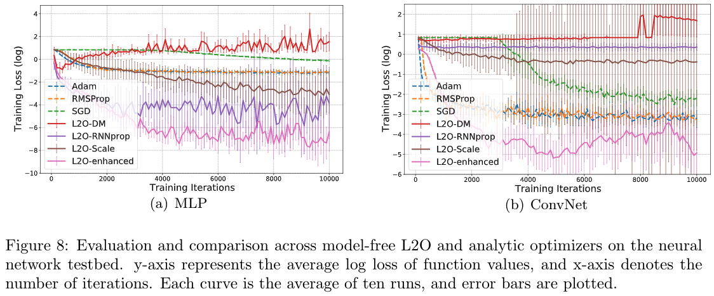

# Open-L2O

This repository establishes the first comprehensive benchmark efforts of existing learning to optimize (L2O) approaches on a number of problems and settings. We release our software implementation and data as the Open-L2O package, for reproducible research and fair benchmarking in the L2O field. [Paper](https://arxiv.org/abs/2103.12828)

[](https://opensource.org/licenses/MIT)

## Overview
### What is learning to optimize (L2O)?

L2O (Learning to optimize) aims to replace manually designed analytic optimization algorithms (SGD, RMSProp, Adam, etc.) with learned update rules.


### How does L2O work?

L2O serves as functions that can be fit from data. L2O gains experience from training optimization tasks in a principled and automatic way.

### What can L2O do for you?

L2O is particularly suitable for solving a certain type of optimization over a specific distribution of data repeatedly. In comparison to classic methods, L2O is shown to find higher-quality solutions and/or with much faster convergence speed for many problems.

### Open questions for research?

- There are significant theoretical and practicality gaps between manually designed optimizers and existing L2O models.


## Main Results
### Learning to optimize sparse recovery



### Learning to optimize Lasso functions



### Learning to optimize non-convex Rastrigin functions



### Learning to optimize neural networks




## Supported Model-base Learnable Optimizers

All codes are available at [here](https://github.com/VITA-Group/Open-L2O/tree/main/Model_Base_L2O).

1. LISTA (feed-forward form) from *Learning fast approximations of sparse coding* [[Paper](https://dl.acm.org/doi/abs/10.5555/3104322.3104374)]
2. LISTA-CP from *Theoretical Linear Convergence of Unfolded ISTA and its Practical Weights and Thresholds* [[Paper](https://arxiv.org/abs/1808.10038)]
3. LISTA-CPSS from *Theoretical Linear Convergence of Unfolded ISTA and its Practical Weights and Thresholds* [[Paper](https://arxiv.org/abs/1808.10038)]
4. LFISTA from *Understanding Trainable Sparse Coding via Matrix Factorization* [[Paper](https://arxiv.org/abs/1609.00285)]
5. LAMP from *AMP-Inspired Deep Networks for Sparse Linear Inverse Problems* [[Paper](https://ieeexplore.ieee.org/document/7934066)]
6. ALISTA from *ALISTA: Analytic Weights Are As Good As Learned Weights in LISTA* [[Paper](https://openreview.net/forum?id=B1lnzn0ctQ)]
7. GLISTA from *Sparse Coding with Gated Learned ISTA* [[Paper](https://openreview.net/forum?id=BygPO2VKPH)]


## Supported Model-free Learnable Optimizers

1. L2O-DM from *Learning to learn by gradient descent by gradient descent* [[Paper](https://arxiv.org/pdf/1606.04474.pdf)] [[Code](https://github.com/Tianlong-Chen/Awesome-L2O/blob/main/Model_Free_L2O/L2O-DM%20and%20L2O-RNNProp/README.md)]
2. L2O-RNNProp *Learning Gradient Descent: Better Generalization and Longer Horizons* from [[Paper](https://arxiv.org/pdf/1703.03633.pdf)] [[Code](https://github.com/Tianlong-Chen/Awesome-L2O/blob/main/Model_Free_L2O/L2O-DM%20and%20L2O-RNNProp/README.md)]
3. L2O-Scale from *Learned Optimizers that Scale and Generalize* [[Paper](https://arxiv.org/pdf/1703.04813.pdf)] [[Code](https://github.com/Tianlong-Chen/Awesome-L2O/blob/main/Model_Free_L2O/L2O-Scale%20/README.md)]
4. L2O-enhanced from *Training Stronger Baselines for Learning to Optimize* [[Paper](https://arxiv.org/pdf/2010.09089.pdf)] [[Code](https://github.com/Tianlong-Chen/Awesome-L2O/blob/main/Model_Free_L2O/L2O-DM%20and%20L2O-RNNProp/README.md)]
5. L2O-Swarm from *Learning to Optimize in Swarms* [[Paper](https://papers.nips.cc/paper/2019/file/ec04e8ebba7e132043e5b4832e54f070-Paper.pdf)] [[Code](https://github.com/Tianlong-Chen/Awesome-L2O/blob/main/Model_Free_L2O/L2O-Swarm/README.md)]
6. L2O-Jacobian from *HALO: Hardware-Aware Learning to Optimize* [[Paper](http://www.ecva.net/papers/eccv_2020/papers_ECCV/papers/123540477.pdf)] [[Code](https://github.com/Tianlong-Chen/Awesome-L2O/blob/main/Model_Free_L2O/L2O-Jacobian/README.md)]
7. L2O-Minmax from *Learning A Minimax Optimizer: A Pilot Study* [[Paper](https://openreview.net/forum?id=nkIDwI6oO4_)] [[Code]()]


## Supported Optimizees

Convex Functions:

- [x] Quadratic
- [x]  Lasso

Non-convex Functions:

- [x] Rastrigin

Minmax Functions:

- [x] Saddle
- [x] Rotated Saddle
- [x] Seesaw
- [x] Matrix Game

Neural Networks:

- [x] MLPs on MNIST
- [x] ConvNets on MNIST and CIFAR-10
- [x] LeNet
- [x] NAS searched archtectures


## Other Resources

- This is a Pytorch implementation of L2O-DM. [[Code](https://github.com/chenwydj/learning-to-learn-by-gradient-descent-by-gradient-descent)]
- This is the original L2O-Swarm repository. [[Code](https://github.com/Shen-Lab/LOIS)]
- This is the original L2O-Jacobian repository. [[Code](https://github.com/RICE-EIC/HALO)]


## Future Works

- [ ] TF2.0 Implementated toolbox v2 with a unified framework and lib dependency.


## Cite

```
@misc{chen2021learning,
      title={Learning to Optimize: A Primer and A Benchmark}, 
      author={Tianlong Chen and Xiaohan Chen and Wuyang Chen and Howard Heaton and Jialin Liu and Zhangyang Wang and Wotao Yin},
      year={2021},
      eprint={2103.12828},
      archivePrefix={arXiv},
      primaryClass={math.OC}
}
```

